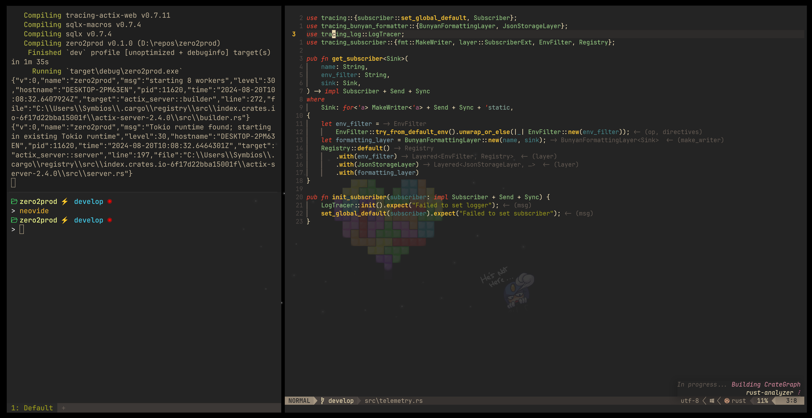

<h1 align="center">🚀 Revinder .windotfiles</h1> 

     

## 📋 Installation
1. Run `./Setup.ps1` file.  
2. Upgrade paths and email in `.gitconfig`
3. Proceed to [Tools](#tools) section.

## 🛠️ Tools

In all honesty, this is meant for personal, and I rarely change systems, which is why you have to install few tools manaully. For me, this hasn't been an issue before.

#### 🐍 Python
Python should have following dependencies installed by now.
1. Install `pyenv-windows` from [here](https://github.com/pyenv-win/pyenv-win)
2. Install [pipx](https://github.com/pypa/pipx?tab=readme-ov-file#on-linux) for isolation of dependencies using given python version
3. All python dependencies should be installed using it now:
    * [Poetry](https://python-poetry.org/docs/#installation)

        `$ pipx install poetry`

#### 🦀 Rust 
1. Install [Rust](https://www.rust-lang.org/tools/install): 

    `$ curl --proto '=https' --tlsv1.2 -sSf https://sh.rustup.rs | sh`

2. Go to `.cargo` and run `$ python install.py` -- this will install all cargo related tools -- be wary, this will take quite a long time.

3. Neovide is missing in the dependencies. Install it manually or build from source.
